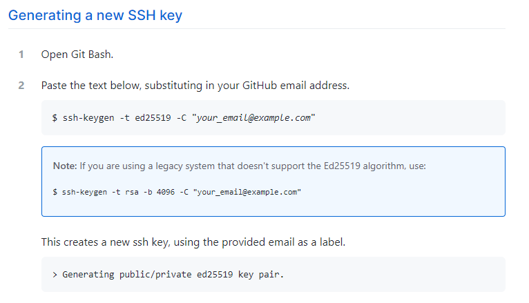
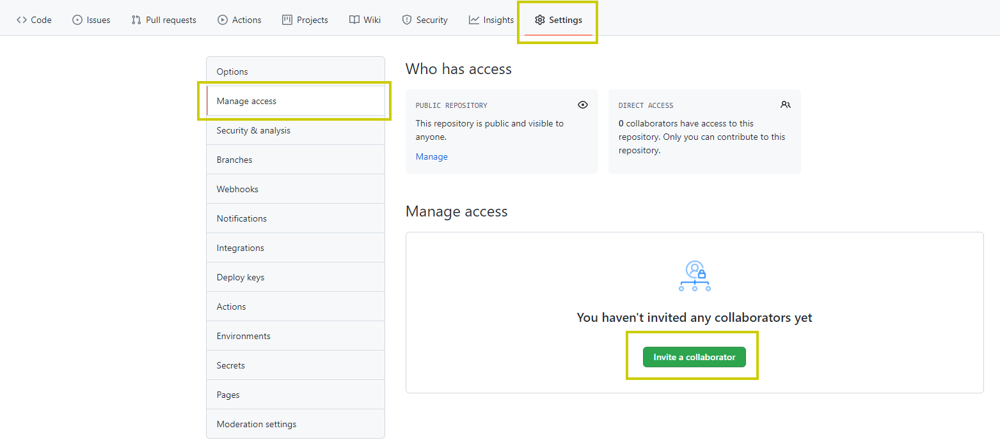

## Déploiement du projet en ligne

Heroku est une plate-forme en ligne qui permet aux développeurs de créer, d'exécuter et de déployer des applications entièrement dans le cloud.

### Versioning du projet

Pour déployer votre site sur Heroku, vous devez d'abord créer votre projet sur GitHub.

Pour cela, suivre les étapes suivantes :

### Création du repo  
* Créer un compte Github
* Créer un repo pour ce projet

#### Configuration de la clé SSH

[Voir documentation](https://docs.github.com/en/github/authenticating-to-github/connecting-to-github-with-ssh/generating-a-new-ssh-key-and-adding-it-to-the-ssh-agent)
 


Créer un fichier `config` dans le dossier `C:\Users\<votre utilisateur>\.ssh` et copiez les lignes suivantes :
```
Host github
    Hostname github.com
    IdentityFile ~/.ssh/<nom de la clef ssh privée>
```

Exemple : 

```
Host github
    Hostname github.com
    IdentityFile ~/.ssh/id_ed25519
``` 

* Dans le répertoire du projet que vous avez cloné (`C:\wamp64\www\symfony-l3-2021`) :
    * Supprimer le dossier `.git`
* Suivre ensuite les lignes de commandes que vous retrouverez dans le repo créé : 

```
git init
git add *
git commit -m "first commit"
git branch -M main
git remote add origin <url SSH du repo>
# Exemple : git remote add origin git@github:VinceBoul/Symfony-L3-2021.git
git push -u origin main
```    
* Ajouter les autres collaborateurs du groupe au projet :
 


### Déploiement des TP notés

Pour faciliter le test et la présentation de chaque projet, tous les groupes de TP doivent suivre la procédure suivante pour déployer leur projet en ligne.

> Si vous déployez projet sur votre propre serveur, vous n'aurez pas besoin de le faire sur Heroku 

* Suivre le tutoriel : https://devcenter.heroku.com/articles/getting-started-with-php

  * Introduction
      * Créer un compte Heroku (1 par groupe)
      * Avoir installé PHP et Composer localement
    * Set up
      * Installer l'executeur de commande Heroku (Windows / MacOS / Ubuntu)
    * Prepare the app : **Le projet a déjà été cloné - Se placer juste dans le dossier via le terminal**
    * Deploy the app : `git push heroku main`
    * View logs
    * Define a Procfile : **Passer cette étape, le fichier `Procfile` existe déjà**
    * Scale the app : **Passer cette étape**
    * Declare app dependencies : **Passer cette étape**
    * Push local changes : **Passer cette étape**
    * Provision add-ons : **Passer cette étape**
    * Start an interactive shell : 
        * Vous pouvez lancer des commandes directement sur la machine avec la commande suivante : `heroku run php bin/console `
    * Define config vars : **Passer cette étape**
    * Provision a database : `heroku addons:create heroku-postgresql:hobby-dev`
    * Next steps : **Passer cette étape**    

* https://devcenter.heroku.com/articles/getting-started-with-php#set-up
